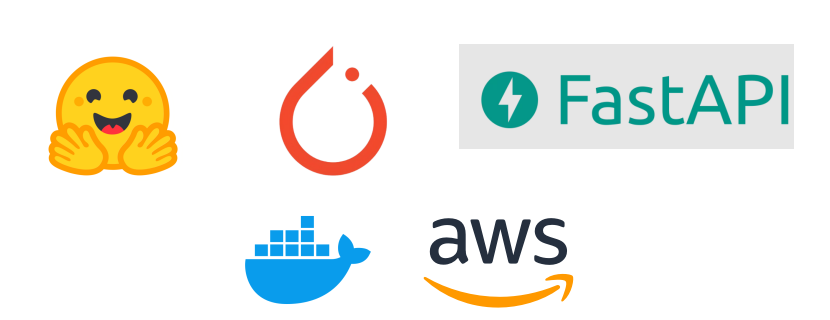
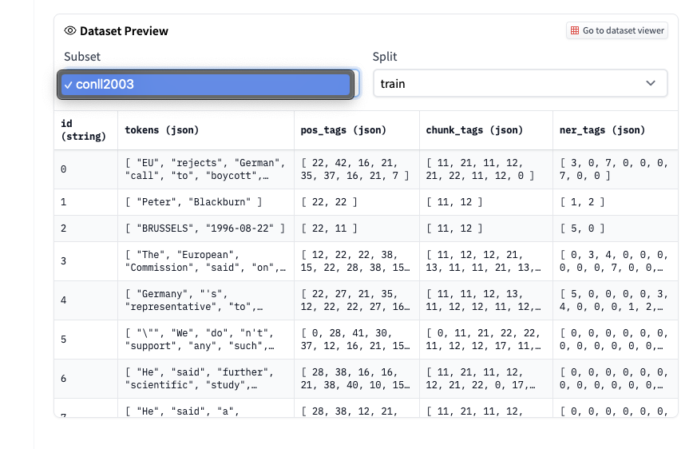
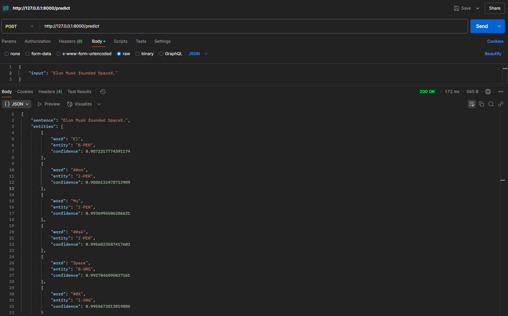
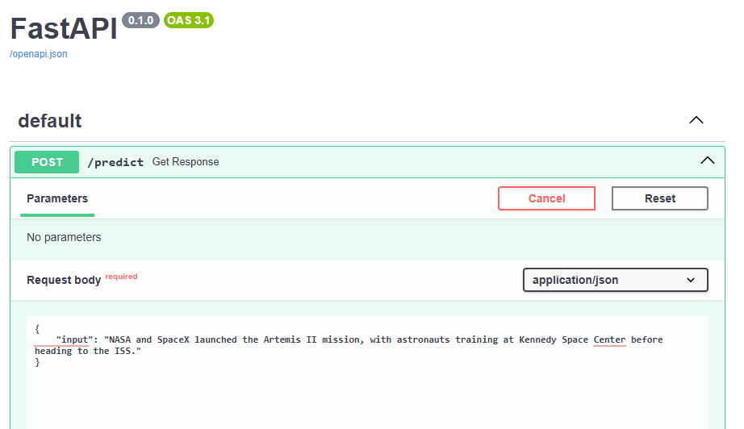
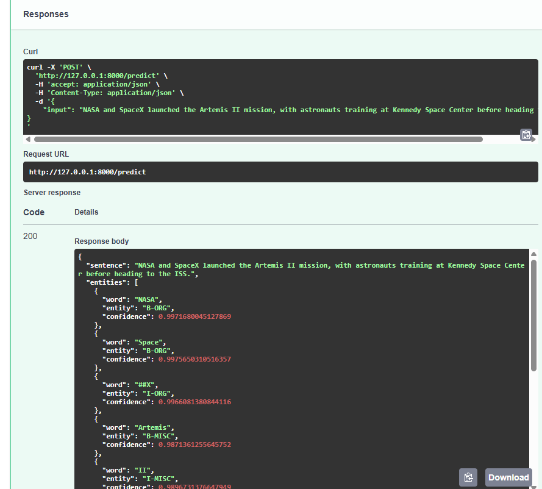

# Named Entity Recognition (NER) API with BERT



## Overview

The aim of the project is to implement a Named Entity Recognition (NER) API by fine-tuning a pretrained BERT model on the CoNLL-2003 dataset. The trained model is integrated into a FastAPI-based REST service that exposes an endpoint /predict which accepts an input text/sentence as JSON and returns the recognized entities. 

## Features
- **Data Preprocessing**: Preprocessed the data in Google Colab, including tokenization and dataset formatting, including padding and word embeddings.
- **Model Training**: Fine-tuned the pretrained BERT model from Hugging Face on the CoNLL-2003 dataset for NER using Google Colab.
- **Model Evaluation**: Assessed model performance using Precision, Recall, and F1-score.
- **Model Serialization & Deployment**: The trained model and tokenizers were saved to local environment for inference.
- **API Integration**: Implemented a FastAPI `/predict` endpoint for real-time entity recognition.
- **Future Enhancements**: Dockerization and deployment on AWS for scalable access.

## Dataset


The model is trained on the [CoNLL-2003 dataset](https://huggingface.co/datasets/eriktks/conll2003), a standard benchmark for Named Entity Recognition tasks. It consists of newswire articles where entities are labeled into four categories: Person (PER), Organization (ORG), Location (LOC), and Miscellaneous (MISC). 

## Project Structure

```
├── app/                 # FastAPI service
│   ├── main.py          # API script
├── notebooks/           # Notebooks containing Data Preprocessing and model training (Google Colab)
├── scripts/             # Utility scripts (e.g., model downloader script)
├── .gitignore           # Excludes model files from GitHub
├── README.md            # Project documentation
└── requirements.txt     # Python dependencies
```
> [!NOTE]  
> Pickle and Joblib files are not standard for saving BERT-based NER models because they do not properly handle transformer architectures, optimizer states, or tokenizers. Hence, the model and tokenizer are saved using Hugging Face's save_pretrained() method and uploaded to Google Drive due to their large size (>400MB), instead of being stored in the repository.

## Installation

### Prerequisities
- Python 3.8+
- Virtual environment (recommended)

### Setup

```bash
# Clone the project repository
git clone https://github.com/haarry9/ner-bert-api.git
# Navigate to the project folder
cd ner-bert-api
# Create a Python virtual environment
python -m venv venv
# Activate the virtual environment
source venv/bin/activate  # On Linux/Mac
venv\Scripts\activate     # On Windows (CMD)
# Install dependencies
pip install -r requirements.txt
```
## Model Folder Storage and Retrieval
Since the size of the model files exceed 400 MB's, they are not stored in the repository. The model folder is uploaded to Google Drive [here](https://drive.google.com/file/d/1TjtdVLCQ1So2TC6ylo6Rttyp2l_yXpvX/view?usp=drive_link). The model folder is ignored in `.gitignore`, and a python script is provided to download the model before running the API.

### Downloading the Model Folder
> [!IMPORTANT]  
> In order to successfully run the NER API, download the model files by executing the below python script.

```bash
python scripts/download_model.py
```
This script will download the fine-tuned model from Google Drive and stores it in the project directory.
The project directory after running the above python download script will be as follows:
```
  ├── model/               # Serialized model and tokenizer
  ├── app/                 # FastAPI service
  │   ├── main.py          # API script
  ├── notebooks/           # Notebooks containg Data Preprocessing and model training (Google Colab)
  ├── scripts/             # Utility scripts (e.g., model download script)
  ├── .gitignore           # Excludes model files from GitHub
  ├── README.md            # Project documentation
  └── requirements.txt     # Python dependencies
```
Here, the model folder contains the following files:
```
model/
├── ner_bert_model/
│   ├── config.json
│   ├── model.safetensors
├── tokenizer/
│   ├── special_tokens_map.json
│   ├── tokenizer_config.json
│   ├── tokenizer.json
│   ├── vocab.txt
```
## Running the NER BERT API
```bash
cd app
uvicorn main:app --reload
```
> [!IMPORTANT]  
> Wait for the "FastAPI app is running..." message before proceeding to test the API (Might take a minute).


## Test the API in Postman:
- Open Postman and set Request Type to `POST`.
- Enter URL:
```bash
http://127.0.0.1:8000/predict
```
- Go to the “Body” Tab → Select raw → Set type to JSON.
- Enter JSON Input:
```json
{
    "input": "Elon Musk founded SpaceX."
}
```
- Click send and obtain the result.



## Testing API via FastAPI's Interactive Docs
- Open `http://127.0.0.1:8000/docs` in a browser.
- Click POST /predict, enter a sentence, and click Execute.

### FastAPI Swagger UI 




# TODO:
- [ ] **Containerization**: Using a Docker-based deployment strategy.
- [ ] **Cloud Deployment**: Deploing the API to AWS Lambda/ECS for accessibility.


## Future Enhancements:
- Implement API authentication and request validation.
- Introduce logging and exception handling for robustness.
- Develop a Streamlit-based UI for interactive entity recognition.

## Acknowledgments
- [Hugging Face Transformers](https://huggingface.co/transformers/)
- [FastAPI Documentation](https://fastapi.tiangolo.com/)
- [Google Colab](https://colab.research.google.com/)
- [CoNLL-2003 Dataset](https://www.kaggle.com/datasets/alaakhaled/conll003-ner)
